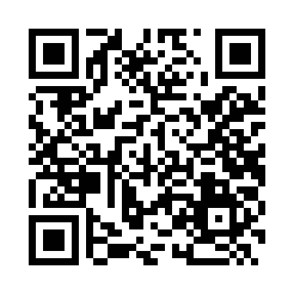
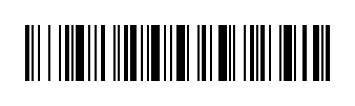
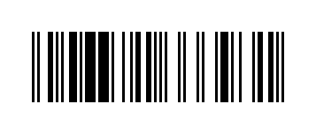

# dsh-qrcode 🔳

> DeepSeek Harness (DSH) 离线二维码 / 条码生成插件：纯本地计算、零网络、零 shell、跨平台。给模型 `qrcode` + `barcode` 两个工具，随手把链接 / WiFi / 文本 / 数字生成二维码或一维条码。

[](LICENSE)
[](https://github.com/topics/dsh-plugin)

## 📖 项目简介

`dsh-qrcode` 是一个 DeepSeek Harness **插件包（bundle）**。它从零实现了完整的 QR 编码器（Reed-Solomon 纠错、GF(256) 运算、掩码评分、全部 40 个版本）以及 Code128 / EAN-13 一维条码，**不依赖任何第三方库**，安装零构建、零网络请求、跨平台。

## ✨ 功能特性

- ✅ **离线纯本地**：无网络、无 shell，隐私安全、秒出结果
- ✅ **二维码**：数字 / 字母数字 / 字节（UTF-8，支持中文和 emoji），4 级纠错 L/M/Q/H，SVG/ASCII/PNG
- ✅ **一维条码**：Code128（可打印 ASCII）、EAN-13（12/13 位，自动校验位），SVG/ASCII/PNG
- ✅ **常用格式**：支持 URL、`WIFI:`、`tel:`、`SMSTO:`、`vCard` 等标准串直接编码
- ✅ **可定制**：前景/背景色、尺寸、边距、强制掩码
- ✅ **已验证**：用 zxing-cpp 解码器验证二维码 96/96、条码 7/7 全部正确解码

## 📸 效果预览

| 二维码 | Code128 | EAN-13 |
|---|---|---|
|  |  |  |

## 🚀 快速开始（傻瓜式）

**环境要求**：已安装 `dsh` CLI（DeepSeek Harness）。

```bash
# 从 GitHub 安装到你的 profile
dsh plugin --profile web add github:hellosky983/dsh-qrcode

# 或从本地目录安装
dsh plugin --profile web add ./dsh-qrcode
```

重启 profile 生效：

```bash
dsh --profile web
```

> 验证是否装好：`dsh --profile web --dump-config` 里能看到 `# == dsh-qrcode` 这一层。

## 📖 使用说明

安装后，模型会多两个工具：

- **`qrcode`**：生成二维码。内容可以是网址、WiFi 串、`tel:`、`SMSTO:`、`vCard` 等任何文本。
- **`barcode`**：生成一维条码。`symbology=code128`（可打印 ASCII）或 `symbology=ean13`（12/13 位数字）。

### 常用编码格式速查

| 想生成的 | 直接写 |
|---|---|
| 网址 | `https://example.com` |
| WiFi | `WIFI:T:WPA;S:我的WiFi;P:密码123;;` |
| 拨号 | `tel:+8613800138000` |
| 发短信 | `SMSTO:+8613800138000:你好` |
| 名片 | `BEGIN:VCARD\nVERSION:3.0\nFN:张三\nTEL:13800138000\nEND:VCARD` |

### `qrcode` 参数

| 参数 | 说明 | 默认值 |
|---|---|---|
| `text` | 要编码的内容（必填） | — |
| `format` | `svg` / `ascii` / `png` | `svg` |
| `ecl` | 纠错级别 `L` / `M` / `Q` / `H` | `M` |
| `scale` | 每个模块像素数 | `4` |
| `border` | 静区宽度（模块数） | `4` |
| `fg` / `bg` | 前景/背景色（hex） | `#000000` / `#ffffff` |
| `mask` | 强制掩码 0–7（省略则自动） | 自动 |

### `barcode` 参数

| 参数 | 说明 | 默认值 |
|---|---|---|
| `text` | 内容：code128 用 ASCII，ean13 用 12/13 位数字 | — |
| `symbology` | `code128` / `ean13` | `code128` |
| `format` | `svg` / `ascii` / `png` | `svg` |
| `scale` / `height` | 模块像素 / 条高（px） | `2` / `60` |
| `border` | 静区（模块数，建议 ≥10） | `10` |
| `fg` / `bg` | 前景/背景色 | `#000000` / `#ffffff` |

## 📁 项目结构

```
dsh-qrcode/
├── package.json        # 声明 dsh.bundle（插件的安装清单）
├── cordis.patch.yml    # 插入到 composition 的补丁层
├── index.js            # 插件入口：QR 编码器 + 条码 + 注册 qrcode/barcode 工具
├── screenshots/        # 效果图
├── README.md
└── LICENSE
```

## ❓ 常见问题（FAQ）

- **Q：为什么 `dsh plugin add github:...` 装完没生效？**
  A：profile 要**重启**才生效。确认 `--dump-config` 里有 `dsh-qrcode` 层。
- **Q：需要网络吗？**
  A：生成完全不需要网络；只有「安装插件」这一步需要联网。
- **Q：EAN-13 能用于真实商品吗？**
  A：编码规则开放、生成合法，但**正式零售商品**的 EAN 码需要向 GS1 申请厂商识别代码（前缀）。测试/内部使用无需。
- **Q：能商用吗？**
  A：MIT 协议，随便用。
- **Q：有图形界面吗？**
  A：当前提供模型工具（`qrcode`/`barcode`）。浏览器面板（`dsh.client`）规划在后续版本。

## 🛠️ 技术栈

纯 JavaScript（ESM）· DeepSeek Harness bundle · `@deepseek-ai/dsh-tools`

## 📄 许可证

MIT © dsh-qrcode contributors
